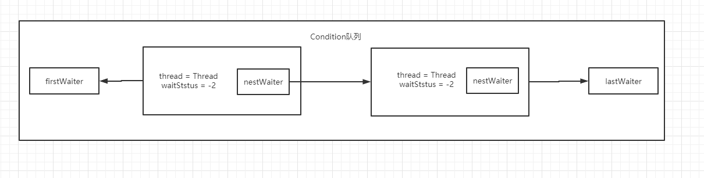

# 并发工具

-----------------
-----------------
## 一、Condition

### 1、Condition
- wait/notify 是用来实现线程之间通信的，要想使用 wait/notify 一定通过synchronized加锁
- Condition 是和 wait/notify 是等价的。  是多线程协调通信的工具类，可以让某个线程一起等到某个条件可以满足的时候才可以被唤醒。

### 2、condition结构


### 3、condition。await() 和 condition.signal() 底层实现
```java
//condition.await()
class ConditionObject{
    public final void await() throws InterruptedException {
        if (Thread.interrupted())
            throw new InterruptedException();
        Node node = addConditionWaiter();//将当前线程加入到Condition等待队列中
        int savedState = fullyRelease(node);//释放锁，这里考虑到了重入锁的情况，全部释放
        int interruptMode = 0;
        //判断当前线程是否在同步队列中（AQS队列）
        while (!isOnSyncQueue(node)) {
            //如果当前线程不在AQS队列中，则让当前线程休眠
            LockSupport.park(this);//当前等待线程阻塞了，让出CPU，让其他线程来争抢这把锁，谁抢到谁来执行，当执行完，释放锁，通知这个等待的线程来执型
            if ((interruptMode = checkInterruptWhileWaiting(node)) != 0)
                break;
        }
        if (acquireQueued(node, savedState) && interruptMode != THROW_IE)
            //争抢锁失败，才设置 REINTERRUPT
            interruptMode = REINTERRUPT;
        
        //到这里，说明休眠的线程可能在Condition中，也可能在AQS中
        
        if (node.nextWaiter != null) // clean up if cancelled
            //如果在Condition中
            unlinkCancelledWaiters();
        if (interruptMode != 0)
            reportInterruptAfterWait(interruptMode);
    }
    //判断当前线程 抛异常/继续中断/0
    private int checkInterruptWhileWaiting(Node node) {
        //如果线程执行了Thread.interrupted()方法，那么就需要重新修改Condition队列中的waitStatus的值
        //如果线程没有执行Thread.interrupted()方法，则直接返回0
        return Thread.interrupted() ?
                (transferAfterCancelledWait(node) ? THROW_IE : REINTERRUPT) :
                0;
    }
    // interruptMode == THROW_IE 的时候，会抛出 throw new InterruptedException()
    private void reportInterruptAfterWait(int interruptMode)
            throws InterruptedException {
        if (interruptMode == THROW_IE)
            throw new InterruptedException();
        else if (interruptMode == REINTERRUPT)
            selfInterrupt();
    }
    

    //将当前线程加入到等待队列中
    //返回一个等待节点Node
    private Node addConditionWaiter() {
        Node t = lastWaiter;
        // If lastWaiter is cancelled, clean out.
        if (t != null && t.waitStatus != Node.CONDITION) {
            unlinkCancelledWaiters();
            t = lastWaiter;
        }
        Node node = new Node(Thread.currentThread(), Node.CONDITION);
        if (t == null)
            firstWaiter = node;
        else
            t.nextWaiter = node;
        lastWaiter = node;
        return node;
    }

    //将
    private void unlinkCancelledWaiters() {
        Node t = firstWaiter;
        Node trail = null;
        while (t != null) {//在Condition中，那么firstWaiter肯定不等于null
            Node next = t.nextWaiter;
            if (t.waitStatus != Node.CONDITION) {
                t.nextWaiter = null;
                if (trail == null)
                    firstWaiter = next;
                else
                    trail.nextWaiter = next;
                if (next == null)
                    lastWaiter = trail;
            }
            else
                trail = t;
            t = next;
        }
    }
}
class AbstractQueuedSynchronizer{
    //是否在同步队列中
    final boolean isOnSyncQueue(Node node) {
        //node.waitCondition == Node.CONDITION 表示当前线程在Condition队列中
        //node.prev存在于AQS队列中，而不存在Condition队列中，所以，如果node.prev == null 那当前线程肯定在Condition中
        if (node.waitStatus == Node.CONDITION || node.prev == null)
            return false;
        if (node.next != null) // If has successor, it must be on queue
            return true;
        return findNodeFromTail(node);
    }
    
    final boolean transferAfterCancelledWait(Node node) {
        // 当线程执行 thread.interrupt()，说明Condition队列没有被修改waitStatus，所以需要将waitStatus改成0
        if (compareAndSetWaitStatus(node, Node.CONDITION, 0)) {
            enq(node);//将Condition中修改完waitStatus状态的线程加入到AQS队列
            return true;
        }
        /*
         * If we lost out to a signal(), then we can't proceed
         * until it finishes its enq().  Cancelling during an
         * incomplete transfer is both rare and transient, so just
         * spin.
         */
        while (!isOnSyncQueue(node))
            Thread.yield();
        return false;
    }
    //争抢锁
    final boolean acquireQueued(final Node node, int arg) {
        boolean failed = true;
        try {
            boolean interrupted = false;
            for (;;) {
                final Node p = node.predecessor();
                if (p == head && tryAcquire(arg)) {//尝试获取锁
                    setHead(node);
                    p.next = null; // help GC
                    failed = false;
                    return interrupted;//争抢锁成功返回interrupted = false
                }
                if (shouldParkAfterFailedAcquire(p, node) &&
                        parkAndCheckInterrupt())
                    //争抢锁失败
                    interrupted = true;
            }
        } finally {
            //如果将Condition中的线程添加到AQS中失败了，那么就取消添加
            if (failed)
                cancelAcquire(node);
        }
    }
    //获取当前线程，执行interrupt()方法
    static void selfInterrupt() {
        Thread.currentThread().interrupt();
    }
}
```
```java
//condition.signal()
class ConditionObject{
    //等待线程阻塞之后，开始执行以下方法，让别的线程来执行
    public final void signal() {
        if (!isHeldExclusively())//判断当前获得所得线程是否等于当前线程
            throw new IllegalMonitorStateException();
        Node first = firstWaiter;//firstWaiter 是Condition队列中的那个等待队列的Node
        if (first != null)
            doSignal(first);
    }
    private void doSignal(Node first) {
        do {
            //将Condition队列中的等待线程移除
            if ( (firstWaiter = first.nextWaiter) == null)
                lastWaiter = null;
            first.nextWaiter = null;
        } while (!transferForSignal(first) &&
                (first = firstWaiter) != null);
    }
    
    class AbstractQueuedSynchronizer{
        final boolean transferForSignal(Node node) {
            /*
             * If cannot change waitStatus, the node has been cancelled.
             */
            if (!compareAndSetWaitStatus(node, Node.CONDITION, 0))
                return false;

            /*
             * Splice onto queue and try to set waitStatus of predecessor to
             * indicate that thread is (probably) waiting. If cancelled or
             * attempt to set waitStatus fails, wake up to resync (in which
             * case the waitStatus can be transiently and harmlessly wrong).
             */
            Node p = enq(node);//将Condition中的等待线程添加到AQS队列中
            int ws = p.waitStatus;
            if (ws > 0 || !compareAndSetWaitStatus(p, ws, Node.SIGNAL))
                LockSupport.unpark(node.thread);//唤醒等待线程
            return true;
        }
    }
}
```
-----------------
-----------------
##  二、CountDownLatch

- 计数器
- 倒计时的方式，实现阻塞和唤醒
- await/countDown

### 1、使用场景
- 阻塞多个线程
- 使计数到 0 就可以让其他县城执行

### 2、原码分析

```java
class CountDownLatch{
    public void await() throws InterruptedException {
        sync.acquireSharedInterruptibly(1);//共享锁
    }
    class Sync{
        //计数器还没有到0的时候返回 -1 
        //计数器到0的时候返回 1
        protected int tryAcquireShared(int acquires) {
            return (getState() == 0) ? 1 : -1;
        }
    }
}
class AbstractQueuedSynchronizer{
    public final void acquireSharedInterruptibly(int arg)
            throws InterruptedException {
        if (Thread.interrupted())//可以被中断，中断抛出异常
            throw new InterruptedException();
        if (tryAcquireShared(arg) < 0)//尝试获取共享锁
            doAcquireSharedInterruptibly(arg);
        //当计数器归0，这里的方法执行完成，等待队列中的head节点的线程获得锁，
        //然后让节点一次向后唤醒其他线程，实现多个唤醒操作
    }
    //在共享锁中断模式下获取，竞争锁
    private void doAcquireSharedInterruptibly(int arg)
            throws InterruptedException {
        final Node node = addWaiter(Node.SHARED);//添加到等待队列中，共享模式
        boolean failed = true;
        try {
            for (;;) {
                final Node p = node.predecessor();
                if (p == head) {
                    int r = tryAcquireShared(arg);//尝试获取共享锁
                    if (r >= 0) {//获取锁成功
                        setHeadAndPropagate(node, r);//依次被唤醒
                        p.next = null; // help GC
                        failed = false;
                        return;
                    }
                }
                if (shouldParkAfterFailedAcquire(p, node) &&
                        parkAndCheckInterrupt())//获取锁失败
                    throw new InterruptedException();
            }
        } finally {
            if (failed)
                //获取共享锁失败的处理
                cancelAcquire(node);
        }
    }

    private void setHeadAndPropagate(Node node, int propagate) {
        Node h = head; // Record old head for check below
        setHead(node);
        /*
         * Try to signal next queued node if:
         *   Propagation was indicated by caller,
         *     or was recorded (as h.waitStatus either before
         *     or after setHead) by a previous operation
         *     (note: this uses sign-check of waitStatus because
         *      PROPAGATE status may transition to SIGNAL.)
         * and
         *   The next node is waiting in shared mode,
         *     or we don't know, because it appears null
         *
         * The conservatism in both of these checks may cause
         * unnecessary wake-ups, but only when there are multiple
         * racing acquires/releases, so most need signals now or soon
         * anyway.
         */
        if (propagate > 0 || h == null || h.waitStatus < 0 ||
                (h = head) == null || h.waitStatus < 0) {
            Node s = node.next;
            if (s == null || s.isShared())
                doReleaseShared();//释放锁
        }
    }
}

```

-----------------
-----------------
##  三、Semaphore 临牌
- 共享锁
### 1、使用场景
- 抢车位模型

### 2、代码实现

```java
package com.conditionpackage.C003_Semaphore;

import java.util.concurrent.Semaphore;
import java.util.concurrent.TimeUnit;

/**
 * @name: Semaphore_001
 * @description:
 * @author: zichen
 * @date: 2021/4/24  15:38
 */
public class Semaphore_001 {

    public static void main(String[] args) {
        Semaphore semaphore = new Semaphore(5);
        for (int i = 1; i < 11; i++) {
            new Car(i, semaphore).start();
        }
    }

    static class Car extends Thread {
        private int num;
        private Semaphore semaphore;

        public Car(int num, Semaphore semaphore) {
            this.num = num;
            this.semaphore = semaphore;
        }

        @Override
        public void run() {
            try {
                semaphore.acquire();//获得一个令牌，如果获取不到令牌，则会阻塞
                System.out.println("第 " + num + " 抢占一个车位");
                TimeUnit.SECONDS.sleep(2);
                System.out.println("第 " + num + " 开走咯");
                semaphore.release();
            } catch (InterruptedException e) {
                e.printStackTrace();
            }
        }
    }
}
```
```text
输出结果：
第 1 抢占一个车位
第 8 抢占一个车位
第 7 抢占一个车位
第 4 抢占一个车位
第 3 抢占一个车位
第 3 开走咯
第 7 开走咯
第 4 开走咯
第 1 开走咯
第 8 开走咯
第 10 抢占一个车位
第 5 抢占一个车位
第 9 抢占一个车位
第 6 抢占一个车位
第 2 抢占一个车位
第 5 开走咯
第 9 开走咯
第 10 开走咯
第 2 开走咯
第 6 开走咯
```

-----------------
-----------------
##  四、CyclicBarrier
- 栅栏
- 可以使一组线程达到一个同步点之前阻塞

### 1、代码实现
- 见C004_CyclicBarrier包