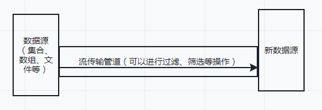
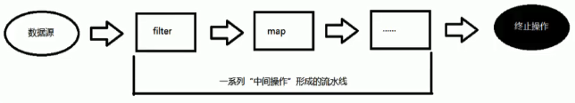

## stream
- stream 是java1.8处理集合的抽象概念，可以对集合进行操作，可以执行非常复杂的查找、过滤和映射等操作。



- 集合讲的是数据，流讲的是计算
**注意**
  - Stream 不存储元素。
  - Stream 不改变元数据对象。会返回一个持有结果的新Stream.
  - Stream 操作是延迟执行的。也就是说，Stream需要等到他需要的结果才会执行

### Stream 的操作三个步骤
#### 创建 Stream
    一个数据源（如：集合、数组、文件等），获取一个流
- 通过 Collection 系列集合提供的stream()（串行流） 或 paralleStream()（并行流）
- 通过 Arrays 中的静态方法stream() 获取数组流
- 通过 Stream 类中的静态方法（of()）
- 创建无限流
    - 迭代
    - 生成

```java
import com.lambda.base.Employee;
import org.junit.Test;

import java.util.ArrayList;
import java.util.Arrays;
import java.util.List;
import java.util.stream.Stream;

class Func1 {
    @Test
    public void test1() {
        // 1. 通过 Collection 系列集合提供的stream()（串行流） 或 paralleStream()（并行流）
        List<String> list = new ArrayList<>();
        Stream<String> stream1 = list.stream();
        // 2. 通过 Arrays 中的静态方法stream() 获取数组流
        Employee[] emps = new Employee[10];
        Stream<Employee> stream2 = Arrays.stream(emps);
        // 3. 通过 Stream 类中的静态方法（of()）
        Stream<String> stream3 = Stream.of("aa", "bb", "cc");
        // 4. 创建无限流
        // 4.1. 迭代
        Stream<Integer> stream4 = Stream.iterate((0, 0), (x, y) -> x + y);
        // 4.2. 生成
        Stream<Integer> stream4_2 = Stream.generate(() -> (int) (Math.random()));
    }
}
```
#### 中间操作
    一个中间操作链，对数据源的数据进行处理
- 筛选和切片
    - filter - 接收Lambda，从流中排出某些元素。
    - limit - 阶段流，使其元素不超过给定数量。
    - skip(n) - 跳过元素，返回一个扔掉了前 n 个元素的流。若流中元素不足 n 个，则返回一个空流。与limit(n)互补。
    - distinct - 筛选，通过流所生成元素的hashCode() 和 equals() 去除重复元素。
- 映射
    - map - 接收 Lambda，将元素转换成其他形式或提取信息，接收一个函数作为参数，该函数会被应用到每个元素上，并将其映射成一个新的元素。
```java
class Test {
    public static void main(String[] args) {
      List<String> list = Arrays.asList("aaa", "bbb", "ccc", "ddd", "eee");
      list.stream().map((str) -> str.toUpperCase()).forEach(System.out::println);

      employees.stream().map(Employee::getName).forEach(System.out::println);
    }
}
```
- 
    - flatMap - 接收一个函数作为参数，将流中的每个值都换成留一个流，然后把所有流连城一个流
```java
import org.junit.Test;
class Test{
    public Stream<Character> filterCharacter(String str){
    List<Character> list=new ArrayList<>();
    for(Character ch:str.toCharArray()){
        list.add(ch);
    }
    return list.stream();
}
    @Test
    public void test() {
        // 1.
        Stream<Stream<Character>> stream = list.stream().map(Test::filterCharacter);
        stream.forEach((strm) -> {
            strm.forEach(System.out::println);
        });
        // 2.
        Stream<Character> stream = list.stream().flatMap(Test::filterCharacter);
        stream.forEach(System.out::println);
    }
}
```
- 排序
  - sorted() - 自然排序，按照字典的顺序排序
  - sorted(Comparator com) - 定制排序
- 规约
  - reduce(T identity, BinaryOperator) / reduce(BinaryOperator) - 可以将流中元素反复结合起来，得到一个值。返回 T
  - reduce(BinaryOperator b) - 可以将流中元素反复结合起来，得到一个值。返回Optional<T>。
备注：map和reduce的连接通常称为map-reduce模式，因Google用它来进行网络搜索而出名。
```java
class Test {
  @Test
  public void test() {
    List<Integer> list = Arrays.asList(1, 2, 3, 4, 5, 6, 7, 8, 9, 10);
    Integer reduce = list.stream().reduce(1, (x, y) -> x + y);
    System.out.println(reduce);

    System.out.println("=========================");

    Optional<Double> reduce1 = employees.stream().map(Employee::getSalary).reduce(Double::sum);
    System.out.println(reduce1.get());
  }
}
```
- 收集
  - collect - 将流转换成其他形式。接收一个Collector接口的实现，用于给Stream中元素做汇总的方法。
  - collect中的组函数，见代码CollectTest.java
  - collect中的分组函数，见代码CollectTest.java
  - collect中的分区，见代码CollectTest.java
  - collect中的joining，见代码CollectTest.java
```java
class Test {
  @Test
  public void test() {
    // 将集合收集到list中
    List<String> collect = employees.stream().map(Employee::getName).collect(Collectors.toList());
    System.out.println(collect);
    System.out.println("================");
    //collect.forEach(System.out::println);
    // 将集合收集到set中
    Set<String> collect1 = employees.stream().map(Employee::getName).collect(Collectors.toSet());
    System.out.println(collect1);
    System.out.println("================");
    // 将结果收集到特殊的集合中的操作
    LinkedHashSet<String> collect2 = employees.stream().map(Employee::getName).collect(Collectors.toCollection(LinkedHashSet::new));
    System.out.println(collect2);
  }
  
}
```
#### 终止操作
    一个终止的操作，执行中间操作链，并产生结果
- 终止操作
  - allMatch - 检查是否匹配所有元素
  - anyMatch - 检查是否至少匹配一个元素
  - noneMatch - 检查是否没有匹配所有元素
  - findFirst - 返回第一个元素
  - findAny - 返回当前流中的任意元素
  - count - 返回流中元素的总个数
  - max - 返回流中最大值
  - min - 返回流中最小值


