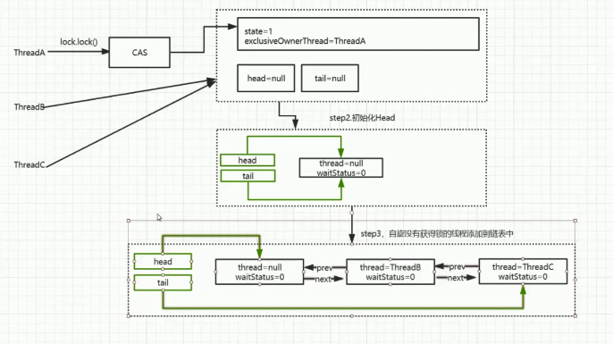

###视频地址：
[JAVA](https://www.bilibili.com/video/BV1ta4y1J7vT?p=29)
### 1、Lock
1）、ReentrantLock - 可重入锁
```txt
    重入 - 增加重入次数
    线程结束，需要减少重入次数
    目的是避免线程死锁
    Lock lock = new ReentrantLock();
    lock.lock();
    lock.unlock();
```
2）、ReentrantReadWriteLock - 重入读写锁
```txt
    ReentrantReadWriteLock rwlock = new ReentrantReadWriteLock();
    读锁 - rwlock.readLock().lock();
    写锁 - rwlock.writeLock().lock();
    - 两个携带读锁的线程，同时读取同一个数据，不会阻塞
    - 一个携带读锁的线程，一个携带写锁的线程，同时操作同一个数据，会发生阻塞（互斥）
    - 两个携带写锁的线程，同时操作同一个数据，会发生阻塞（互斥）
```

---------------------------
### 2、JUC
---------------------------
### 3、ReentrantLock重入锁
---------------------------
### 4、AQS原理分析 （同步工具）
- 独占 -> 互斥
- 共享 -> 读写锁
#### 1）AQS基本实现
```txt
    借助AQS，实现线程的阻塞
    a、AQS内部维护了一个队列（tail，head）；
        <队列是由一个一个Node组成，每个Node就是一个线程>
    b、当线程竞争激烈的情况下，AQS会将没有竞争到锁的线程（第一个被添加的线程）(Node)添加到队列的中；
        <每次添加Node到队列中的时候，都要判断队列的tail是否为空，如果不为空则将Node加入到队列；如果为空则执行方法enq(final Node node),将队列的最后一个节点置为head=tail，然后在将Node添加到队列> - 下面c操作也会执行这部分逻辑
    c、当有其他线程也没有争抢到锁，AQS也会将接下来的线程（Node）添加到队列中；
```

---------------------------
### 5、AQS源码分析

```java
class AbstractQueuedSynchronizer {
    
    private transient volatile Node head;//Queue head
    private transient volatile Node tail;//Queue tail
    
    //将线程加入队列
    private Node addWaiter(Node mode) {
        Node node = new Node(Thread.currentThread(), mode);
        // Try the fast path of enq; backup to full enq on failure
        Node pred = tail;
        if (pred != null) {
            node.prev = pred;
            if (compareAndSetTail(pred, node)) {
                pred.next = node;
                return node;
            }
        }
        enq(node);
        return node;
    }
    
    //判断队列的tail是否为空，然后进行线程入队操作
    private Node enq(final Node node) {
        for (;;) {
            Node t = tail;
            if (t == null) { // Must initialize
                if (compareAndSetHead(new Node()))
                    tail = head;
            } else {
                node.prev = t;
                if (compareAndSetTail(t, node)) {
                    t.next = node;
                    return t;
                }
            }
        }
    }
    
    /**
     * 对一个未被加入队列的线程执行获得锁，后者是加入队列操作
     * 1、如果前序节点还在排队（waitStatus=-1），后续节点直接挂起；
     * 2、如果前序节点取消了（waitStatus=1），后续节点的逻辑中会把取消的前序节点删除（递归删除）；
     * 3、如果前序节点也是刚加进来的，节点状态还没定，也没有获得锁，那么当前线程要把前序节点的waitStatus设置为-1；
     */
    final boolean acquireQueued(final Node node, int arg) {
        boolean failed = true;
        try {
            boolean interrupted = false;
            for (;;) {
                //1. 如果线程可以获得锁，则，死循环不停地去获得
                final Node p = node.predecessor();//拿到线程的前序节点
                if (p == head && tryAcquire(arg)) {//如果前序节点时队列的头，并且尝试拿到锁
                    setHead(node);
                    p.next = null; // help GC    
                    failed = false;
                    return interrupted;
                }
                //2. 如果线程不可以获得锁，则，加入AQS等待队列中
                if (shouldParkAfterFailedAcquire(p, node) &&
                    parkAndCheckInterrupt())
                    interrupted = true;
            }
        } finally {
            if (failed)
                //取消获取锁状态
                cancelAcquire(node);
        }
    }
}
/**
 * 每个线程也相当于一个Node 
 */
class Node {
    static final Node SHARED = new Node();//共享锁
    static final Node EXCLUSIVE = null;//独占锁
    
    /** waitStatus value to indicate thread has cancelled */
    static final int CANCELLED =  1;//取消状态，或删除该状态的节点，让后面的节点上来
    /** waitStatus value to indicate successor's thread needs unparking */
    static final int SIGNAL    = -1;//释放锁，被通知的状态
    /** waitStatus value to indicate thread is waiting on condition */
    static final int CONDITION = -2;//
    /**
     * waitStatus value to indicate the next acquireShared should
     * unconditionally propagate
     */
    static final int PROPAGATE = -3;//
    
    volatile int waitStatus;//线程状态
    
    volatile Node prev;//线程链接队列的tail的node
    volatile Node next;//当Node链接到队列上，next就成为了队列的tail
    volatile Thread thread;//线程
    //Node nextWaiter;
    //获得线程（Node）的前序节点
    final Node predecessor() throws NullPointerException {
        Node p = prev;
        if (p == null){throw new NullPointerException();}
        else{return p;}
    }
}

class AbstractQueuedSynchronizer {
    /**
     * 唤醒
     */
    private void unparkSuccessor(Node node) {
        // 获取当前线程的waitStatus
        int ws = node.waitStatus;
        /*
         * waitStatus =   -1   |   -2 |   -3   |   1   |   0
         * SIGNAL | CONDITION | PROPAGATE | CANCELLED | （INIT）
         */
        if (ws < 0)
            // CAS 将当前线程的status改为 0  ，释放锁
            compareAndSetWaitStatus(node, ws, 0);

        // 由于每一个线程都被封装成一个Node
        Node s = node.next;
        //判断当前释放锁的Node(线程) 的 下一个 Node(线程) 是否为空？
        if (s == null || s.waitStatus > 0) {
            s = null;
            // 寻找后面不为空的Node(线程) ，然后将它复制给 s
            for (Node t = tail; t != null && t != node; t = t.prev)
                if (t.waitStatus <= 0)
                    s = t;
        }
        // 将不为空的 s 唤醒
        if (s != null)
            LockSupport.unpark(s.thread);
    }

    private static final boolean compareAndSetWaitStatus(Node node, int expect, int update) {
        return unsafe.compareAndSwapInt(node, waitStatusOffset, expect, update);
    }
}


class LockSupport{
    //唤醒线程
    public static void unpark(Thread thread) {
        if (thread != null)
            UNSAFE.unpark(thread);
    }
    //休眠
    public static void park(Object blocker) {
        Thread t = Thread.currentThread();
        setBlocker(t, blocker);
        UNSAFE.park(false, 0L);
        setBlocker(t, null);
    }
}

class UNSAFE{
    public native void unpark(Object var1);//休眠
    public native void park(boolean var1, long var2);//唤醒
    public final native boolean compareAndSwapInt(Object var1, long var2, int var4, int var5);
}
```

### 6、AQS执行图示



